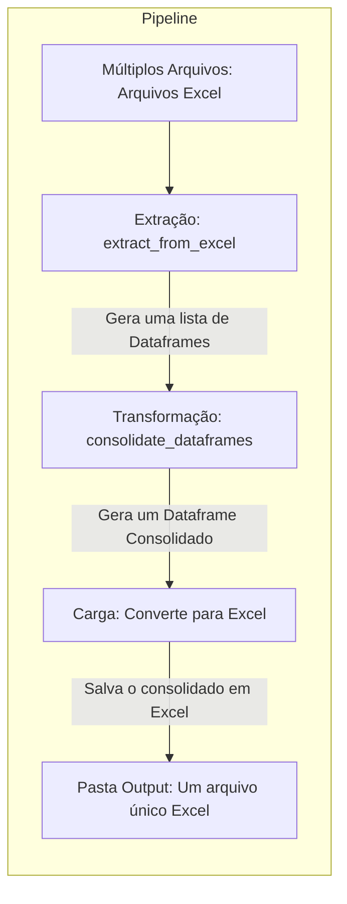

# Welcome to MkDocs

For full documentation visit [mkdocs.org](https://www.mkdocs.org).

## Workflow

# Função de Extração de Dados
### ::: app.pipeline.extract.extract_from_excel

# Função de Tranformação de Dados
### ::: app.pipeline.transform.concat_to_dataframe