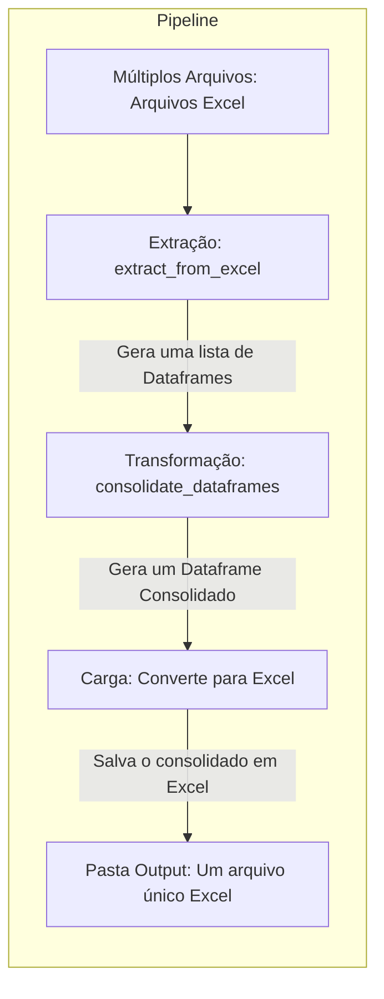

# Bem-vindo(a) ao Projeto de ETL
Este projeto foi desenvolvido com práticas de estruturação de projetos, documentações, testes e códigos de maneira modularizada, o objetivo final é construir uma ETL com python na qual consolida 50 arquivos em Excel em um único arquivo.

Para conhecer mais sobre meu trabalho, visite [vorges-data](https://www.vorges.com.br).

## Workflow

# Função de Extração de Dados
### ::: app.pipeline.extract.extract_from_excel

# Função de Tranformação de Dados
### ::: app.pipeline.transform.concat_to_dataframe

# Função de Carga de Dados
### ::: app.pipeline.load.load_excel
